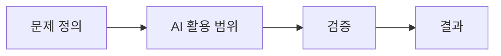

# AI를 활용한 코딩 경험 공유

> 작성 목적: AI 보조 개발을 실무에 적용한 경험, 한계, 개선 시도를 정리하여 팀 내 공유 및 회고에 활용한다.

---

## 요약

AI 도구를 코딩·분석·보고 업무에 도입하면서 **공수 절약** 효과를 확인했으나, 프롬프트·에이전트·Git 연동 측면에서 **운영 비용**도 함께 발생했다. 이를 **문제 정의 → AI 활용 범위 → 검증 → 결과** 흐름으로 관리하고, Agent 분업과 PCTF 프롬프트 체계로 품질을 보완하는 방향으로 개선 중이다.

---

## 1. 경험 공유 (성과)

### 1.1 Legacy 코드 분석을 통한 시간 절약

- 기존 코드베이스의 구조·의존 관계·비즈니스 로직 파악에 AI를 활용했다.
- 수동으로 파일을 따라가며 이해하던 시간을 **탐색·요약·질의** 단계로 압축할 수 있었다.
- 분석 결과는 반드시 **실제 코드·실행·동료 리뷰**로 교차 검증한 뒤 의사결정에 반영했다.

### 1.2 보고서 작성 부담 감소

- 1차·2차·완료 보고서 초안을 AI가 생성하고, 담당자는 **검수·수정·맥락 보정**에 집중할 수 있었다.
- “무엇을 쓸지부터 고민”하던 시간을 “**맞는지 확인**”하는 시간으로 전환했다.
- 보고서 품질의 최종 책임은 여전히 작성자(검수자)에게 있다.

### 1.3 공수 절약 워크플로우

아래 4단계로 AI 활용 범위를 명확히 하여 불필요한 수정·재작업을 줄였다.

| 단계 | 설명 | AI 역할 | 담당자 역할 |
|------|------|---------|-------------|
| **문제 정의** | 목표·제약·완료 기준 정리 | 시나리오·체크리스트 제안 | 요구사항 확정 |
| **AI 활용 범위** | 분석 / 초안 / 문서 / 테스트 등 역할 분리 | 지정 범위 내 산출 | 범위 밖(설계·보안) 직접 처리 |
| **검증** | 테스트·리뷰·실행·Git diff 확인 | — | 채택·거절·수정 |
| **결과** | 산출물·보고·이슈 반영 | 초안·요약 | 최종 승인·배포 |



---

## 2. Problem (어려움·한계)

### 2.1 프롬프트 전송 후 취소·롤백의 어려움

- 프롬프트 내용에 **오타·누락·잘못된 지시**가 있어도 Send 이후에는 취소가 거의 불가능하다.
- 잘못된 지시가 곧바로 **파일 수정·다중 파일 변경**으로 이어져 복구 비용이 커진다.

**대응 방향:** 전송 전 체크리스트, 작은 단위 요청, 변경 전 브랜치·커밋 분리.

### 2.2 프롬프트 미숙으로 인한 과도한 코드 수정

- 프롬프트가 모호하거나 범위가 넓으면 **의도하지 않은 파일·모듈까지** 수정되는 경우가 발생했다.
- “이 함수만”이 아닌 “이 영역 전체”로 해석되어 diff가 불필요하게 커졌다.

**대응 방향:** 수정 대상 파일·함수 명시, “수정 금지 영역” 명시, PCTF 방식 프롬프트 정교화.

### 2.3 보고서 맥락 불일치 (1차 → 2차 → 완료)

- 단계별 보고서를 각각 생성할 때 **용어·진행률·이슈 서술**이 단계 간 맞지 않는 경우가 종종 발생했다.
- 이전 보고서를 컨텍스트로 넣지 않거나, 요약만 반복하면 **스토리 단절**이 생긴다.

**대응 방향:** 이전 단계 보고서를 반드시 첨부, 변경 diff·이슈 번호 기준으로 갱신 지시.

### 2.4 Git 연동 지연

- AI 에이전트와 Git(커밋·푸시·브랜치·PR) 연동 시 **응답·동기화가 느린** 경우가 많아 작업 흐름이 끊겼다.
- 대량 변경 시 diff 검토와 병행하기 어렵다.

**대응 방향:** 로컬에서 자주 커밋, AI에게 Git 작업은 최소 범위로 위임, PR 단위 축소.

---

## 3. Try (개선 시도)

### 3.1 Agent 역할 세분화를 통한 분업 시스템

여러 Agent에 **역할을 나누어** 한 번에 “만들기+문서+리팩터”를 시키지 않는다.

| Agent 역할 (예시) | 담당 | 비고 |
|-------------------|------|------|
| **분석 Agent** | Legacy 구조·의존성·리스크 파악 | 코드 수정 최소 |
| **구현 Agent** | 지정 범위 내 코드·테스트 초안 | 파일·함수 범위 고정 |
| **문서 Agent** | 보고서·README·PR 설명 | 코드 diff 참조 |
| **검수 Agent** | 요구사항 대비 gap·할루시네이션 점검 | 수정 권한 제한 |

- **효과:** 의도하지 않은 영역 수정 감소, 보고서·코드 맥락 분리.
- **주의:** Agent 간 handoff 시 **동일 컨텍스트(이슈 ID, 브랜치, 이전 산출물)** 를 명시해야 한다.

### 3.2 PCTF 방식 프롬프트 체득 (할루시네이션 완화)

프롬프트를 **PCTF** 구조로 작성하여 AI가 추측할 여지를 줄인다.

| 항목 | 의미 | 작성 예 |
|------|------|---------|
| **P — Problem** | 해결할 문제·배경 | “레거시 A 모듈의 N+1 쿼리 제거” |
| **C — Context** | 관련 파일·제약·금지 사항 | “`UserService.java`만, DB 스키마 변경 금지” |
| **T — Task** | 구체적 작업·완료 조건 | “목록 API 1곳 수정, 단위 테스트 추가” |
| **F — Format** | 출력 형식 | “diff 요약 + 변경 이유 3줄 + 테스트 명령” |

**PCTF 프롬프트 템플릿**

```markdown
## Problem
(무엇을 왜 해결하는지)

## Context
- 대상 파일/모듈:
- 수정 금지:
- 참고 문서/이전 보고:

## Task
- 할 일 (체크리스트):
- 완료 조건:

## Format
- 출력 형식 (표, diff만, 보고서 섹션 등):
```

- **기대 효과:** 원하지 않는 파일 수정 감소, 보고서·코드 산출 형식 통일, 검증 단계에서 비교 용이.

---

## 4. 회고 및 다음 액션

| 구분 | 내용 |
|------|------|
| **Keep** | Legacy 분석·보고 초안에 AI 활용, 4단계(정의→범위→검증→결과) 워크플로우 |
| **Problem** | Send 후 취소 어려움, 과수정, 보고 맥락 불일치, Git 연동 지연 |
| **Try** | Agent 분업, PCTF 프롬프트, 단계별 보고서 컨텍스트 연결 |
| **Next** | 전송 전 PCTF 체크리스트 표준화, Agent별 권한·범위 문서화, Git 작업은 사람이 주도·AI는 초안만 |

---

## 부록: 전송 전 체크리스트 (권장)

- [ ] Problem·완료 조건이 한 문장으로 명확한가?
- [ ] 수정 **대상**과 **금지** 파일을 적었는가?
- [ ] 이전 단계 보고서·이슈 링크를 넣었는가?
- [ ] 브랜치·커밋 상태를 확인했는가?
- [ ] 한 번에 하나의 Agent 역할만 요청하는가?

---

*문서 버전: 1.0 · 프로젝트: -KPT-_B-*
