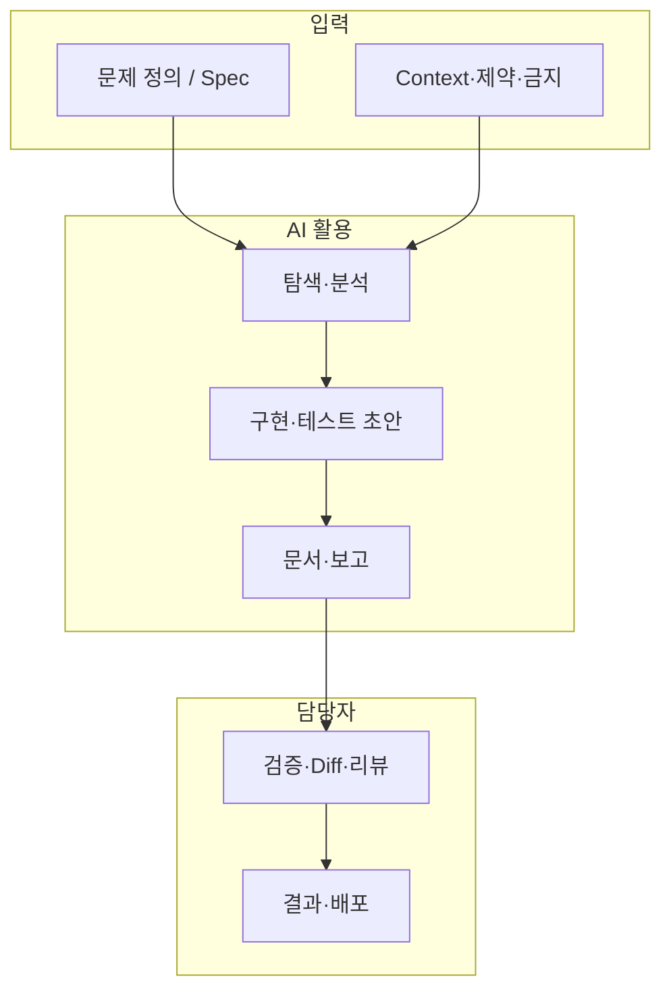

# -KPT-_B- 통합 회고 보고서

> **프로젝트:** -KPT-_B- (Best Problem Practice)  
> **맥락:** Cursor 등 AI 도구를 활용한 Vibe 코딩 · 레거시 분석 · TDD 기반 리팩토링 실습  
> **작성·리뷰:** 김정용(Author) · 남원희 · 박성준 · 변중배 · 송성훈 · 김대경 · 최혁성(Reviewer)

본 문서는 저장소 하위 **모든 KPT·회고 문서**를 통합·요약한 버전이다.  
원문: `README.md`, `docs/KPT_김정용.md`, `KPT_남원희.md`, `KTP_박성준.md`, `KTP_변중배`

---

## 1. 통합 요약 (한 페이지)

| 구분 | 핵심 메시지 |
|------|-------------|
| **가치** | Legacy 탐색·리팩토링·테스트·문서·보고서에서 **2~3시간 이상** 수준의 시간 절약 체감. 담당자는 **검증·설계·승인**에 집중. |
| **전환** | 하드코딩 → “코드를 잘 짜는 것”에서 Vibe 코딩 → **“AI에게 무엇을 어떤 순서로 시킬지 설계”**가 품질을 좌우. |
| **공통 리스크** | 프롬프트 오류·과수정·할루시네이션·컨텍스트 단절·Diff 생략·Git/처리 지연 → **검증 공수**가 다시 발생. |
| **공통 대응** | **PCTF** 프롬프트, **Agent 역할 분업**, **단계 분리**(Red-Green-Refactor·분석/구현/문서), **Spec·금지 조건** 명시, **이전 보고서·제약 재첨부**. |

---

## 2. 통합 Keep (지속할 점)

팀원별 표현을 주제별로 묶었다.

### 2.1 코드 탐색·Legacy 이해

- 낯선 레거시에 **구조·호출 관계·UI-로직 연결·다이어그램**을 빠르게 정리해 진입 장벽 감소.
- 사람이 전 코드를 읽기 전 **전체 그림**을 잡아 리팩토링·TDD 출발점 명확화.
- 상호 참조 분석으로 코드 파악 시간 **약 2~3시간 단축** 체감 (변중배).

### 2.2 리팩토링·품질

- **단일 책임** 분리, 인자 변경 시 **동작 동일성**, Code Smell 완화 제안.
- Gilded Rose 등 사례에서 정적 분석·구조 재구성으로 **3시간 이상** 절약 체감 (변중배).
- Red → Green → 골든마스터 → 리팩토링 흐름에서 AI 제안·검증 병행.

### 2.3 테스트·자동화

- 테스트 케이스·Golden Master·커버리지 **초안 자동 생성**.
- 환경 세팅 후 동작 확인까지 **30분 미만** 사례 (변중배).
- 에러·스택 트레이스 해석으로 **디버깅 시간·심리 부담** 감소 (남원희).

### 2.4 문서·보고서

- 1차·2차·완료 보고, README, 주석, TDD 단계별 결과를 **초안 생성 → 검수**로 전환.
- PCTF / P-C-T-F(Finding) 등 **형식 통일**로 맥락 정리·최종 보고 자동화에 활용.

### 2.5 프롬프팅·프로세스 역량

- **PCTF**, 7Step 등 원칙 학습 → 프로젝트별 **응용 기반** 마련 (남원희).
- **문제 정의 → AI 활용 범위 → 검증 → 결과** 4단계로 공수·재작업 관리 (김정용).
- 요구사항·TODO·단계별 점검·문서 템플릿으로 **방향 이탈 조기 발견**.

### 2.6 도구·자원 (남원희·김정용)

- VSCode 기반 다른 AI CLI, OpenRouter 등 **경량 모델 분산**.
- 매크로 / Skill / **Agent 분업**(분석·구현·문서·검수).
- AI를 **소모 자원**으로 인식하고 요청 단위·승인 구조를 의식적으로 설계.

---

## 3. 통합 Problem (문제·한계)

| # | 문제 | 상세 | 언급 |
|---|------|------|------|
| 1 | **프롬프트 민감성·오지시** | 오타·한 문장 실수도 **실행 명령**으로 처리 (예: Green 단계에 “Git 제출” 포함 시 실제 제출 시도). Send 후 **취소·롤백 거의 불가**. | 박성준, 김정용 |
| 2 | **과도한 코드 수정** | 범위가 모호하면 **의도하지 않은 파일·모듈**까지 변경, diff 비대. | 김정용 |
| 3 | **할루시네이션·검증 부담** | 프롬프트 조합마다 결과 상이, 원인 추적 어려움. 탐색 오류가 **테스트·리팩토링 기준**까지 오염. | 변중배, 박성준 |
| 4 | **컨텍스트 손실** | 긴 대화·동시 작업 시 **제약·완료 항목 누락**·자동 요약으로 정보 유실. 새 세션 시 맥락 재설명 부담. | 변중배, 남원희, 김정용 |
| 5 | **보고서 맥락 불일치** | 1차·2차·완료 보고 간 **용어·진행률·이슈** 불일치. Spec이 숫자·조건 없으면 성공 판단 기준 상이. | 김정용, 박성준 |
| 6 | **단계·Diff 생략** | Red-Green-Refactor를 한 프롬프트에 묶으면 **중간 과정 생략**, 변경 이유 재확인 필요. | 변중배 |
| 7 | **속도·자동화 기대와 현실** | AI 처리·**Git 연동 지연**, 단계마다 **승인 대기** → 화면 주시·흐름 단절. “완전 자동화” 불가. | 남원희, 김정용 |
| 8 | **중간 자료 추가** | 진행 중 새 자료 추가 시 **기존 완료 항목 재요약·유실**, 전체 재지정 공수. | 변중배 |
| 9 | **리팩토링 기준 모호** | 변경 허용 범위·성공 기준 미정의 시 평가·동작 보존 확인 어려움. | 박성준 |

---

## 4. 통합 Try (개선·실천)

### 4.1 프롬프트·단계 제어

**PCTF (Problem · Context · Task · Format)**

| 항목 | 내용 |
|------|------|
| Problem | 해결 목표·배경 |
| Context | 대상 파일, **수정 금지**, 이전 보고·Spec |
| Task | 체크리스트·완료 조건 |
| Format | diff 요약, 보고 섹션, 테스트 명령 등 |

- 단계별 **허용/금지** 명시: `분석만`, `파일 수정 금지`, `Git 명령 금지`, `Git은 사람이 주도`.
- Red / Green / Refactor / Git 제출 **프롬프트·세션 분리**, Step-by-step 출력·**Diff·변경 사유 의무**.
- 전송 전 **체크리스트**: Problem 한 문장, 대상·금지 파일, 이전 보고 첨부, 브랜치 상태, Agent **한 역할만** 요청.

### 4.2 Agent·워크플로우

| Agent (예) | 담당 | 원칙 |
|------------|------|------|
| 분석 | 구조·의존·리스크 | 코드 수정 최소 |
| 구현 | 지정 범위 코드·테스트 | 파일·함수 고정 |
| 문서 | 보고·README·PR | diff·Spec 참조 |
| 검수 | gap·할루시네이션 | 수정 권한 제한 |

- Handoff 시 **이슈 ID, 브랜치, 이전 산출물** 동일 컨텍스트 유지.
- 제약 내장 **전용 Agent** + 짧은 Command로 일관 제어 (변중배).
- 중간 자료 추가 시 **세션 분리** 또는 변경 없는 영역 **Lock** (변중배).

### 4.3 TDD·리팩토링·검증 (박성준·변중배)

1. **Spec**을 숫자·명확한 조건으로 사전 정의.
2. AI 탐색 결과 ↔ **실제 코드** 대조 (파일·함수·호출 관계 기록).
3. Red: 실패 조건 명확화 → Green: 최소 통과 → Refactor: 골든마스터·기존 테스트 유지.
4. 리팩토링 기준: 단일 책임, 동일 입력·동일 결과, UI·핵심 로직 불변.
5. 보고서 필수 항목: Spec, Red/Green/Refactor 결과, 골든마스터 비교, 실패 시 **파일·라인**, Self-Correction 기록.

### 4.4 프로젝트·자원 관리 (남원희)

- 코드 전 **요구사항 정의**에 시간 투자; 한 번에 전부 맡기지 않고 **단계·의존관계 설계**.
- TODO·단계 완료 시점 **결과 확인**; 문서 **템플릿** 사전 준비.
- OpenRouter 등으로 단위 작업 **모델 분산**; 무분별 요청으로 **할당량·속도** 저하 방지.

---

## 5. 팀원별 KPT 요약

### 5.1 김정용 — `docs/KPT_김정용.md`

**Keep:** Legacy AI 분석, 보고서 검수 중심, 4단계(정의→범위→검증→결과) 공수 절약.  
**Problem:** Send 후 취소 어려움, 과수정, 단계별 보고 맥락 불일치, Git 연동 느림.  
**Try:** Agent 4역할 분업, PCTF 체득, 전송 전 체크리스트·Next 액션(Agent 권한 문서화, Git은 사람 주도).

---

### 5.2 남원희 — `KPT_남원희.md`

**맥락:** Cursor로 하드 코딩 → Vibe 코딩 실습.

**Keep:** 코드 탐색·리팩토링 제안·에러 분석, 테스트·보고·문서·모듈 설치 자동화, PCTF/7Step 등 프롬프팅 학습.  
**Problem:** AI 처리 속도·승인 구조로 인한 대기, Context 한계·대화 단절, 워크플로우·AI 자원 효율 필요성.  
**Try:** VSCode AI CLI·OpenRouter·매크로·Skill·Agent, 요구사항 우선·프로세스·TODO·문서 템플릿.

---

### 5.3 박성준 — `KTP_박성준.md`

**맥락:** Cursor AI Agent 기반 레거시 리팩토링 (TDD).

| 단계 | Keep 요지 | Problem 요지 | Try 요지 |
|------|-----------|--------------|----------|
| 코드 탐색 | 구조·UI 흐름 빠른 파악 | 프롬프트 한 줄도 명령으로 수행 | 분석만·수정/Git 금지, 검증 기록 |
| 리팩토링 제안 | 단일 책임·동작 보존 방향 | 기준 없으면 범위·평가 모호 | 사전 기준 4항 + 목적·범위·검증 전달 |
| 테스트 자동화 | R-G-R 전 단계 필요 | 탐색 오류 → 테스트 기준 오류 | 탐색 검증 후 Red/Green/GM |
| 문서·보고 | TDD 단계 추적 용이 | Spec 모호 시 판단 불일치 | 숫자 Spec, 파일·라인 단위 기록 |

**종합:** 탐색 효과 큼. 프롬프트·단계·Git **분리 관리** 필수. Spec 숫자화 + 신뢰 가능한 보고 체계.

---

### 5.4 변중배 — `KTP_변중배`

**Keep:** 유기적 코드 탐색(2~3h↓), 리팩토링(3h+↓), 테스트·GM(30분↓), P-C-T-F 기반 보고.  
**Problem:** 할루시네이션·검증 반복, 컨텍스트 손실, 중간 자료 추가 시 요약 유실, R-G-R 동시 요청으로 Diff 생략.  
**Try:** Self-Correction, 전용 Agent·Command, 세션 분리·Lock, R-G-R 분리·Diff·변경 사유 의무.

---

## 6. 통합 실천 체크리스트

### 작업 시작 전

- [ ] Spec·완료 조건이 **측정 가능**한가? (숫자·조건)
- [ ] PCTF(또는 P-C-T-F)로 Problem·Context·Task·Format 작성했는가?
- [ ] 수정 **대상 / 금지** 파일·Git·단계가 명시되었는가?
- [ ] Agent **역할 하나**만 요청하는가?

### AI 산출 후

- [ ] 탐색·제안이 **실제 코드**와 일치하는가?
- [ ] **Diff·변경 사유**를 확인했는가? (단계 생략 여부)
- [ ] Red / Green / 골든마스터·기존 테스트 **유지** 여부
- [ ] 보고서가 **이전 단계·Spec**과 용어·진행률이 맞는가?

### 이슈 발생 시

- [ ] 오답 구간 **역질문**(Self-Correction)
- [ ] 컨텍스트 유실 시 제약·완료 항목 **재첨부** 또는 세션 분리
- [ ] 잘못된 대량 수정 시 브랜치·커밋 기준 **롤백**

---

## 7. Keep · Problem · Try 매트릭스 (팀 공통)

|  | **Keep** | **Problem** | **Try** |
|--|----------|-------------|---------|
| **탐색** | 구조·흐름·시간 절약 | 탐색 오류 전파, 프롬프트 오지시 | 분석만, 검증 기록 |
| **구현** | 리팩토링·테스트 초안 | 과수정, 기준 모호, Diff 생략 | PCTF, R-G-R 분리, Spec 숫자화 |
| **문서** | 보고 초안·템플릿 | 맥락 불일치, Spec 모호 | 이전 보고 첨부, 라인 단위 기록 |
| **운영** | Agent·다중 도구 | 속도·Git·컨텍스트·할당량 | 분업 Agent, 세션 Lock, 자원 분산 |

---

## 8. 다음 스프린트 제안 (통합 Next)

1. **팀 공통 PCTF + 전송 전 체크리스트**를 `docs/`에 표준 템플릿으로 고정.
2. **Red / Green / Refactor / Git / 문서** 프롬프트 템플릿을 단계별로 분리 보관.
3. **전용 Agent**(제약 내장)와 Command 목록 정의 — 컨텍스트 재입력 최소화.
4. 보고서에 **Spec · 단계별 테스트 · 파일:라인** 필수 필드 통일.
5. Git·대량 변경은 **사람 주도**, AI는 초안·분석까지만 위임하는 규칙 합의.

---

## 9. 원본 문서 목록

| 경로 | 작성·주제 |
|------|-----------|
| `README.md` | 프로젝트 메타, Author/Reviewer |
| `docs/KPT_김정용.md` | AI 코딩 경험, 4단계 워크플로, Agent·PCTF |
| `KPT_남원희.md` | Vibe 코딩, 자동화·프롬프팅·자원 관리 |
| `KTP_박성준.md` | 레거시 리팩토링 TDD 4단계 KPT |
| `KTP_변중배` | 프로세스 개선, 시간 절약 수치, Diff·컨텍스트 |

---

*통합 문서 버전: 1.0 · 생성: 저장소 전 문서 통합 요약*
