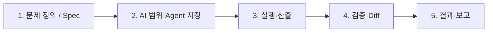

# AI 활용 개발 실습 통합 보고서

**프로젝트:** -KPT-_B- (Best Problem Practice)  
**실습 주제:** Cursor 기반 Vibe 코딩 · 레거시 분석 · TDD 리팩토링  
**Author:** 김정용  
**Reviewer:** 남원희, 박성준, 변중배, 송성훈, 김대경, 최혁성  

> 본 문서는 `프롬프트 작성안.md`를 **제외한** 저장소 내 문서를 통합·요약한 **보고용** 버전이다.  
> 통합 대상: `README.md`, `docs/KPT_김정용.md`, `KPT_남원희.md`, `KTP_박성준.md`, `KTP_변중배.md`, `context 유지.md`, `통합.md`

---

## 보고서 요약 (Executive Summary)

1. **효과:** Legacy 코드 탐색·리팩토링·테스트·문서 작업에서 **약 2~3시간(탐색), 3시간+(리팩토링), 30분 미만(테스트 세팅)** 수준의 시간 절감을 체감했다. 담당자 역할은 **초안 생성 → 검증·승인**으로 이동했다.

2. **패러다임 전환:** 핵심 역량이 “코드 작성”에서 **“AI에게 무엇을 어떤 순서로 시킬지 설계”**로 이동했다. 워크플로·Spec·프롬프트 품질이 결과를 좌우한다.

3. **주요 리스크:** 프롬프트 오지시·과수정·할루시네이션·컨텍스트 손실·TDD 단계 생략·Git/처리 지연으로 **검증 공수**가 재발생한다.

4. **팀 합의 개선안:** **PCTF** 프롬프트, **Agent 4역할 분업**, **Red-Green-Refactor·Git·문서 단계 분리**, **Spec 숫자화**, **단계별 Context 재확인** 절차.

5. **권고:** AI는 분석·초안까지, **Git·최종 배포·대량 diff 승인은 사람이 주도**한다.

---

## 1. 배경 및 목적

| 항목 | 내용 |
|------|------|
| **배경** | Cursor 등 LLM 도구로 하드 코딩에서 Vibe 코딩으로 전환하는 실습 |
| **목적** | AI 보조 개발의 효과·한계를 KPT(Keep / Problem / Try)로 정리하고 팀 공유 |
| **범위** | 코드 탐색, 리팩토링, 테스트 자동화, 문서·보고서, 프롬프트·Agent 운영 |

---

## 2. 주요 성과 (Keep)

### 2.1 정량적 체감 (변중배)

| 영역 | 효과 |
|------|------|
| 코드 전체 파악 | **약 2~3시간** 단축 |
| 리팩토링 (Gilded Rose 등) | **3시간 이상** 단축 |
| Golden Master·테스트 세팅 | **30분 미만** |

### 2.2 정성적 성과 (팀 공통)

**코드·Legacy**

- 구조·호출 관계·UI-로직 연결·다이어그램을 AI가 빠르게 정리 → 낯선 코드베이스 **진입 장벽 감소**
- 리팩토링 시 단일 책임 분리, 동작 동일성, Code Smell 완화 **방향 제안**

**테스트·품질**

- Red → Green → Golden Master → Refactor 흐름에서 테스트·평가 기준 **초안 자동화**
- 스택 트레이스·에러 해석으로 **디버깅 시간·심리 부담** 감소

**문서·보고**

- 1차·2차·완료 보고, README, TDD 단계별 기록을 **AI 초안 → 담당자 검수**로 전환
- PCTF / P-C-T-F(Finding) 형식으로 **문맥·최종 보고** 정리

**프로세스·역량 (김정용·남원희)**

- **문제 정의 → AI 활용 범위 → 검증 → 결과** 4단계 워크플로로 재작업 감소
- PCTF, 7Step 등 프롬프팅 원칙 학습 → 프로젝트별 **응용 기반** 확보

---

## 3. 어려움 및 원인 (Problem)

| 구분 | 현상 | 원인·영향 |
|------|------|-----------|
| **프롬프트** | Send 후 취소·롤백 어려움; 한 줄 오지시도 실행 (예: Green 단계에 “Git 제출”) | 복구·diff 검토 공수 증가 |
| **범위** | 의도하지 않은 파일·모듈까지 수정 | 프롬프트 모호, Agent 역할 혼합 |
| **신뢰성** | 할루시네이션, 프롬프트마다 결과 상이 | 검증·수정 반복; 탐색 오류가 테스트 기준까지 전파 |
| **컨텍스트** | 제약·완료 항목 누락, 대화 단절, 중간 자료 추가 시 자동 요약 유실 | 매번 재명시; 1차·2차·완료 보고 **맥락 불일치** |
| **TDD·Diff** | Red-Green-Refactor 동시 요청 시 **중간 과정 생략** | 변경 이유·성공 기준 재확인 필요 |
| **Spec** | 숫자·조건 없는 Spec | AI와 사람의 **성공 판단 기준 상이** |
| **운영** | AI 처리·Git 연동 지연, 단계별 승인 대기 | “완전 자동화” 기대와 괴리, 화면 주시 필요 |
| **자원** | 무분별 요청 시 할당량·속도 저하 | — |

---

## 4. 개선 방안 (Try) — 운영 가이드

### 4.1 표준 워크플로

| 단계 | AI | 사람 |
|------|-----|------|
| 문제 정의 | 시나리오·체크리스트 제안 | Spec·완료 조건 확정 (**측정 가능**) |
| AI 범위 | 분석/구현/문서 중 **한 역할** | 설계·보안·Git |
| 검증 | — | 코드 대조, 테스트, diff, 리뷰 |
| 결과 | 초안·요약 | 승인·배포 |

### 4.2 PCTF 프롬프트 (할루시네이션·과수정 완화)

| 항목 | 내용 |
|------|------|
| **P** Problem | 해결 목표·배경 |
| **C** Context | 대상 파일, **수정 금지**, 이전 보고·Spec |
| **T** Task | 체크리스트·완료 조건 |
| **F** Format | diff 요약, 보고 섹션, 테스트 명령 |

**금지·허용 예:** `분석만`, `파일 수정 금지`, `Git 명령 금지` — Red / Green / Refactor / Git / 문서는 **세션·프롬프트 분리**.

### 4.3 Agent 분업

| Agent | 담당 | 원칙 |
|-------|------|------|
| 분석 | 구조·의존·리스크 | 코드 수정 최소 |
| 구현 | 지정 범위 코드·테스트 | 파일·함수 고정 |
| 문서 | 보고·README·PR | diff·Spec 참조 |
| 검수 | gap·할루시네이션 | 수정 권한 제한 |

- Handoff 시 **이슈 ID, 브랜치, 이전 산출물** 동일 유지  
- 제약 내장 **전용 Agent** + Command (변중배)  
- 중간 자료 추가: **세션 분리** 또는 Lock

### 4.4 TDD·리팩토링 검증 (박성준·변중배)

1. Spec을 **숫자·명확한 조건**으로 사전 정의  
2. AI 탐색 결과 ↔ 실제 코드 대조 (파일·함수·호출 관계 기록)  
3. **Red** (실패 조건) → **Green** (최소 통과) → **Refactor** (GM·기존 테스트 유지)  
4. 리팩토링 기준: 단일 책임, 동일 입력·동일 결과, UI·핵심 로직 불변  
5. 보고 필수: Spec, R/G/R 결과, GM 비교, 실패 **파일:라인**, Self-Correction

### 4.5 Context 유지 절차 (`context 유지.md`)

**원칙:** 각 Step마다 AI에게 **재분석**을 요청해 현 단계·진행 사항을 확인한 뒤 다음 작업 진행.

| 순서 | 행동 | 프롬프트 예시 |
|------|------|----------------|
| 1 | 현황 파악 | `@doc/ @README.md @src/` 분석 후 **진행해야 할 사항을 넘버링** |
| 2 | 단계 확인 | 넘버링 항목별 **진행 여부 check** 후 상세 진행 |
| 3 | 세부 실행 | `phase4 5번 진행 계획 정리해서 알려줘` 등 **단일 단계** 지시 |

→ 컨텍스트 손실·방향 이탈을 **조기에 발견**하는 운영 패턴.

### 4.6 프로젝트·자원 관리 (남원희)

- 요구사항·TODO·단계별 점검·**문서 템플릿** 사전 준비  
- OpenRouter 등 **경량 모델 분산**; Cursor 단일 의존 완화  
- VSCode AI CLI, 매크로 / Skill / Agent로 반복 작업 패턴화

---

## 5. 팀원별 KPT 한눈에 보기

| 구성원 | 맥락 | Keep (핵심) | Problem (핵심) | Try (핵심) |
|--------|------|-------------|----------------|------------|
| **김정용** | AI 코딩·보고 실무 | Legacy 분석, 4단계 워크플로, 보고 검수 | Send 후 취소 불가, 과수정, 보고 맥락 불일치, Git 지연 | Agent 분업, PCTF, 전송 전 체크리스트 |
| **남원희** | 하드→Vibe 코딩 | 탐색·리팩터·에러·테스트·문서·모듈 자동화 | 처리 속도, 승인 대기, Context 단절 | 다중 도구, 요구사항·TODO·템플릿 |
| **박성준** | TDD 레거시 리팩터 | 구조·UI 흐름 파악, GM·단계별 문서 | 프롬프트 민감, Spec·기준 모호 | 분석/Git 금지, Spec 숫자화, 라인 단위 기록 |
| **변중배** | 프로세스·수치 | 2~3h·3h+·30분 절감, P-C-T-F 보고 | 할루시네이션, Context·중간 자료 유실, Diff 생략 | Self-Correction, 전용 Agent, R-G-R 분리 |

---

## 6. 박성준 — TDD 단계별 요약

| 단계 | Keep | Problem | Try |
|------|------|---------|-----|
| 코드 탐색 | 다이어그램·UI 흐름·시뮬레이션 정리 | 프롬프트 한 줄도 명령으로 수행 | 분석만·수정/Git 금지, 검증 기록 |
| 리팩토링 | 단일 책임·동작 보존 제안 | 변경 허용 범위 모호 | 4대 기준 + 목적·범위·검증 전달 |
| 테스트 | R-G-R·GM 전 단계 필요 | 탐색 오류 → 잘못된 테스트 기준 | 탐색 검증 후 Red/Green/GM |
| 문서 | TDD 추적·라인 단위 정리 | Spec 모호 시 판단 불일치 | 숫자 Spec, 보고 7항목 필수 |

---

## 7. 결론 및 제언

### 7.1 결론

- AI는 **Legacy 진입·구조 이해·초안 생산**에서 가장 큰 가치를 냈다.  
- 동시에 **프롬프트·컨텍스트·단계 관리** 비용이 새로운 핵심 공수가 되었다.  
- “AI가 코드를 짠다”기보다 **“사람이 워크플로를 설계하고 AI 산출을 검증한다”**는 모델이 팀 실습의 공통 결론이다.

### 7.2 다음 액션 (Next)

| # | 액션 |
|---|------|
| 1 | 팀 공통 **PCTF + 전송 전 체크리스트** 표준화 (`docs/`) |
| 2 | Red / Green / Refactor / Git / 문서 **프롬프트 템플릿** 분리 보관 |
| 3 | **전용 Agent**·Command 목록 — 제약 재입력 최소화 |
| 4 | 보고서 필수: **Spec · R/G/R · 파일:라인** 통일 |
| 5 | **Context 유지** 3단계(넘버링 → check → 단계 실행)를 스프린트 기본 절차로 채택 |
| 6 | Git·대량 변경 **사람 주도**, AI는 분석·초안까지 |

---

## 8. 부록

### 8.1 작업 전·후 체크리스트

**시작 전**

- [ ] Spec·완료 조건이 측정 가능한가?
- [ ] PCTF 작성·대상/금지 파일·단계 명시?
- [ ] Agent 역할 **하나**만 요청?
- [ ] `@doc/` `@README.md` `@src/` 기준 **진행 항목 넘버링** 확인?

**산출 후**

- [ ] 탐색·제안 ↔ 실제 코드 일치?
- [ ] Diff·변경 사유·단계 생략 여부?
- [ ] Red / Green / GM 유지?
- [ ] 보고서가 이전 단계·Spec과 일치?

### 8.2 보고서 필수 항목 (TDD·리팩토링)

- 사전 Spec (숫자·조건)
- Red: 실패해야 하는 테스트
- Green: 통과한 테스트
- Refactor 후 유지 동작
- Golden Master 비교
- 실패·부족 항목
- **파일명 · 라인 번호**

### 8.3 통합 출처 목록

| 파일 | 비고 |
|------|------|
| `README.md` | 프로젝트·참여자 |
| `docs/KPT_김정용.md` | 4단계, Agent, PCTF |
| `KPT_남원희.md` | Vibe 코딩, 자원 관리 |
| `KTP_박성준.md` | TDD 4단계 KPT |
| `KTP_변중배.md` | 수치·Diff·Context |
| `context 유지.md` | Step별 재분석·넘버링 절차 |
| `통합.md` | 1차 통합본 (본 문서는 보고용 재정리) |

**제외:** `프롬프트 작성안.md`

---

*통합_2.md · 버전 2.0 · 보고용 요약본*
